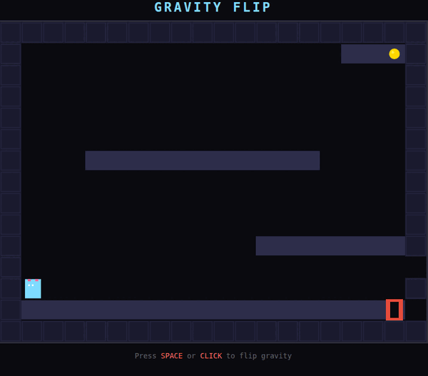
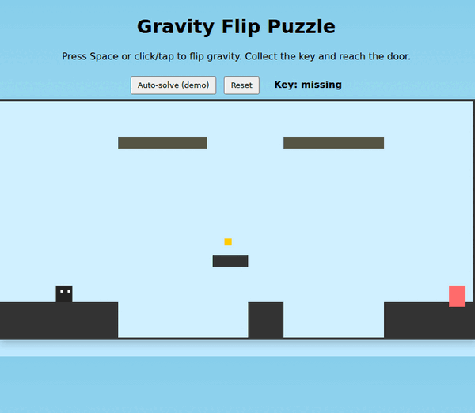
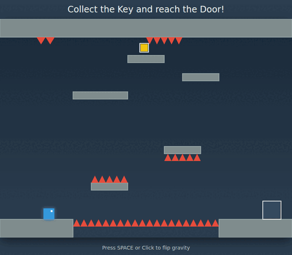
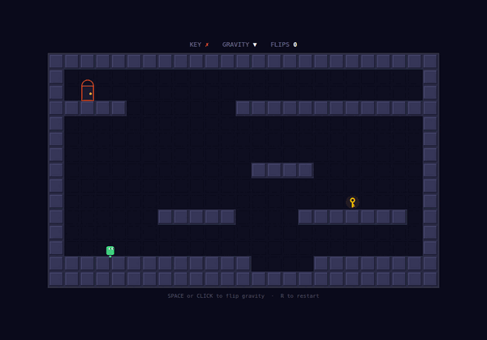
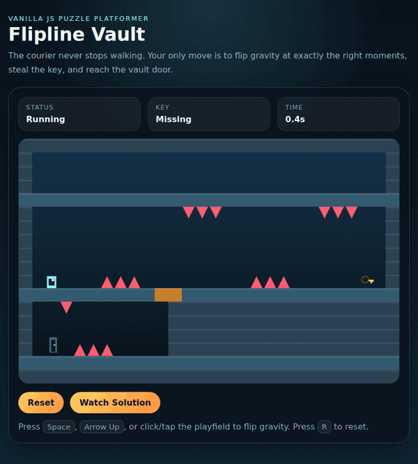
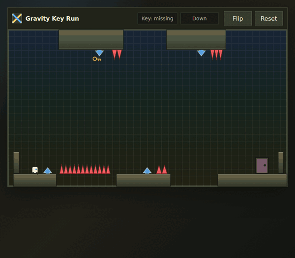
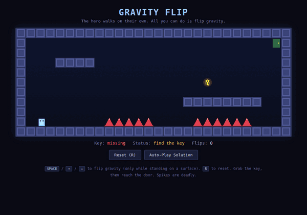

# FlipWalker ゲームベンチマーク

[English](README.md) | 日本語

パズルゲームを制作するための同一のプロンプトを複数の AI コーディングエージェントに与え、結果を比較するベンチマークである。同一プロンプトに対する各モデルの出力を比較するという形式は、[ペリカンSVGベンチマーク](https://simonwillison.net/tags/pelican-riding-a-bicycle/)に倣ったものだ。ペリカンSVGベンチマークは「自転車に乗るペリカンを SVG で描いて」という一文を各モデルに与え、その出力を視覚的に比較することで LLM の能力差を示した試みで、本ベンチマークはそのゲーム制作版に相当する。

## プロンプト

> キャラクターが自動的に左右に往復し、プレイヤーは重力を反転させるだけの小さなバニラ JavaScript パズルゲームを作成せよ。目標は鍵を取得して扉に到達することである。精密な重力反転を要求する障害物を複数配置した、よく設計されたレベルを作れ。鍵への到達にも扉への到達にも重力反転が必要である。キャラクターの歩行タイミングと重力反転が噛み合うよう丁寧に調整された、明確な解法経路を持ち、解いたときに達成感を感じられるレベルにせよ。ソリューションをステップごとにシミュレートしてゲームをテストし、レベルが意図通りにクリアできることを確認し、クリアを妨げる問題があれば修正せよ。

各エージェントにはこのプロンプトから 3 バージョンを生成させ、レビューして最も出来の良いものを選択した。

## 結果

### OpenCode / MiniMax M2.5

[OpenCode](https://opencode.ai/) は多数の LLM で動作できるオープンソースの AI コーディングエージェントだ。いくつかの無料モデルに対応しており、2026 年 4 月時点では MiniMax M2.5 と Nemotron 3 が利用可能なモデルに含まれているが、無料モデルのラインナップは頻繁に変わる。

[デモをプレイ](https://abagames.github.io/flipwalker-game-benchmark/opencode-minimax/)

この結果は要求された自動歩行キャラクターを実装していない。代わりに、プレイヤーは空中でボタンを押している間だけ左右に移動できるようだ。鍵と思われる黄色い円は床に埋まっており、収集できない。

### GitHub Copilot CLI / GPT-5 mini high

[GitHub Copilot](https://github.com/features/copilot) は Microsoft の AI コーディングエージェント製品で、GitHub を通じて提供される。無料ユーザーでも GPT-5 mini や Claude Haiku 4.5 などの軽量 LLM を利用できる。

[デモをプレイ](https://abagames.github.io/flipwalker-game-benchmark/copilot-gpt5mini/)

この作品は障害物に頼らず、興味深いレベルを作成している。ただし画面上端の外側に見えない床があり、それを利用できてしまうためレベルの意図したデザインの多くが損なわれている。

### Gemini CLI / gemini-3-flash-preview

[Gemini CLI](https://geminicli.com/) は Google のオープンソース AI コーディングエージェントだ。Gemini 3 ファミリーのモデルを使用でき、無料ユーザーは `gemini-3-flash-preview` などのモデルにアクセスできる。

[デモをプレイ](https://abagames.github.io/flipwalker-game-benchmark/gemini-gemini3flash/)

基本的なゲームメカニクスは実装されているが、鍵がスパイクの近くに配置されており、生成されたレベルはクリア不可能だ。

### Amp / Claude Opus 4.6

[Amp](https://ampcode.com/) は CLI に広告を表示する代わりに 1 日あたり約 10 ドル分の LLM 使用を提供することで注目を集めた。広告はその後廃止されたが、1 日 10 ドルの無料使用枠は現在も利用できる。

[デモをプレイ](https://abagames.github.io/flipwalker-game-benchmark/amp-claudeopus46/)

この作品は比較的複雑なレベルが実現できているが、解くのは簡単である。浮遊する鍵など視覚的な細部はよく仕上がっている。

### Codex CLI / GPT-5.4 xhigh

[Codex](https://openai.com/codex/) は ChatGPT 向けの OpenAI のコーディングエージェントだ。比較的寛大なレート制限のもとで最新の GPT モデルにアクセスできる。

[デモをプレイ](https://abagames.github.io/flipwalker-game-benchmark/codex-gpt54/)

鍵で操作するフロアメカニクスを実装した唯一の作品だ。レベル自体はあまり面白くなく、スパイクの配置が非常に厳しいためクリアが困難だ。

### Codex CLI / GPT-5.5 xhigh

GPT-5.5 はこのベンチマークで Codex を通じて利用できる最新モデルだ。

[デモをプレイ](https://abagames.github.io/flipwalker-game-benchmark/codex-gpt55/)

プレゼンテーションは洗練されているが、レベルデザインはごく平凡で、壁に当たって左右反転する仕組みを活用していない。

### Claude Code / Claude Opus 4.7 xHigh

[Claude Code](https://code.claude.com/docs/en/overview) は Anthropic のコーディングエージェントだ。Claude Opus は、小さなゲームの制作のような曖昧な仕様に基づくクリエイティブなコーディングタスクに強いと考える。

[デモをプレイ](https://abagames.github.io/flipwalker-game-benchmark/claudecode-claudeopus47/)

Amp のエントリと同じ Claude Opus モデルファミリーを使用しているため、見た目や動きが似たゲームとなった。ゲーム構造とビジュアルはクリーンだが、レベルデザインはあまり面白くない。

## 総評

2026 年 4 月時点では、現在のコーディングエージェントと LLM は重力反転パズルゲームのルールは容易に実装できる。エントリによってビジュアルの品質は異なるが、ほとんどのエージェントがおおむね適切なゲーム画面を生成した。

レベルデザインは弱点だ。「ソリューションをステップごとにシミュレートしてゲームをテスト」するよう指示すると、エージェントはシミュレーションを構築して何らかの解法が存在することを確認しようとする。しかしそれは、本当に「解いたときに達成感を感じられる」複雑で充実したレベルを作れることを意味しない。楽しいパズルを作るには、より詳細なデザイン指示と、単なるクリア可能性以上のものを評価できる検証ハーネスが必要だろう。
