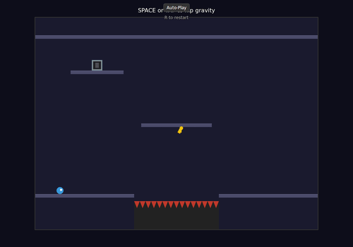
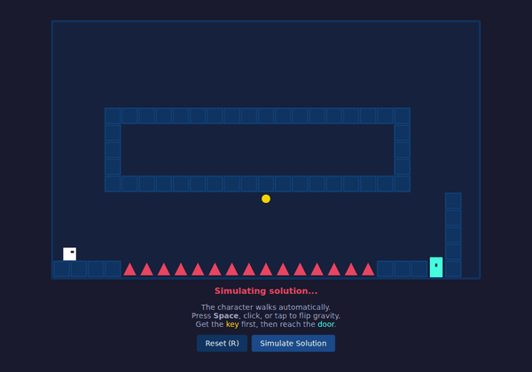
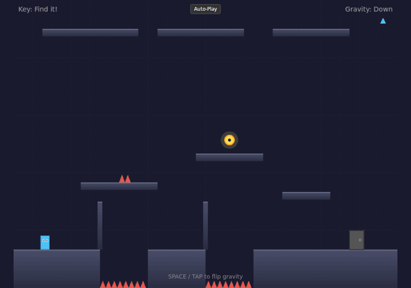
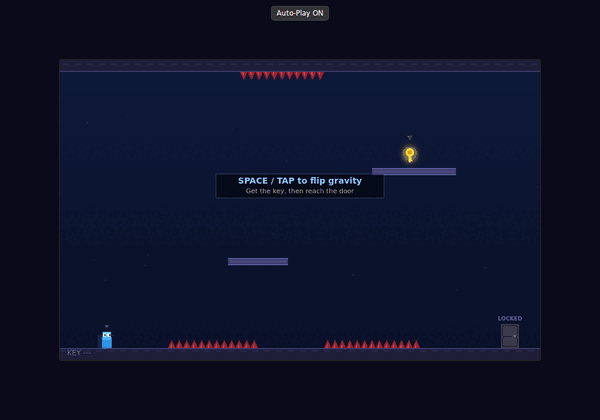
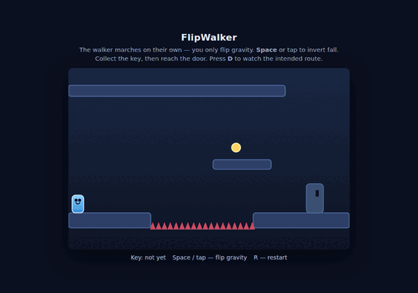
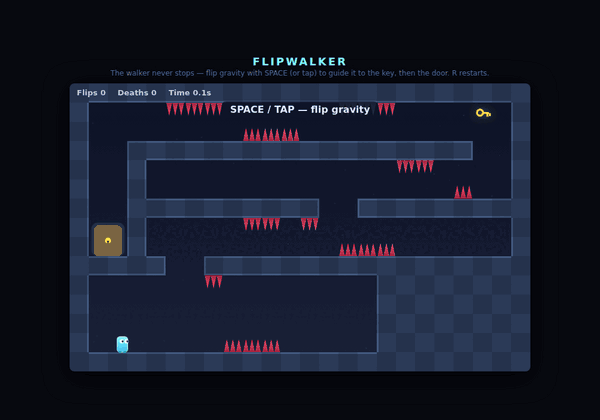

# FlipWalker Game Benchmark

English | [日本語](README.ja.md)

A benchmark that gives the same puzzle-game prompt to multiple AI coding agents and compares the results. The format is inspired by the [Pelican SVG benchmark](https://simonwillison.net/tags/pelican-riding-a-bicycle/), which gave each model the same single-sentence prompt to draw a pelican riding a bicycle in SVG, then compared the outputs visually to illustrate differences in LLM capability. This benchmark is the game-development equivalent.

## The prompt

> Create a small vanilla JavaScript puzzle game where a character automatically walks back and forth, the player can only flip gravity, and the goal is to get a key and reach a door. Design a well-crafted level with multiple obstacles that require precise gravity flips—both to reach the key and to reach the door. The level should have a clear intended solution path that feels satisfying to solve, with the layout carefully tuned so the character's walk timing and gravity flips align correctly. Test the game by simulating the solution step-by-step, verify the level is completable as intended, and fix any issues that prevent completion.

Each agent was asked to generate three versions from this prompt, and I selected the result that looked best on review.

## Results

### OpenCode / MiniMax M2.5

[OpenCode](https://opencode.ai/) is an open-source AI coding agent that can run with many different LLMs. It supports several free models; as of April 2026, MiniMax M2.5 and Nemotron 3 are among the available options, though the free model lineup changes often.

[Play the demo](https://abagames.github.io/flipwalker-game-benchmark/opencode-minimax/)

The result does not implement the requested automatically walking character. Instead, the player appears to move left and right only while airborne. The yellow circle that seems to be the key is embedded in the floor and cannot be collected.

### OpenCode / Kimi K2.6

OpenCode's subscription [OpenCode Go](https://opencode.ai/go) lets you use several high-performance LLMs at a low price. One of them is Kimi K2.6, which shows stable performance in coding.

[Play the demo](https://abagames.github.io/flipwalker-game-benchmark/opencode-kimik26/)

Stable gameplay and a reasonably interesting level design.

### OpenCode / Kimi K2.7 Code

[Kimi K2.7 Code](https://platform.kimi.ai/docs/guide/kimi-k2-7-code-quickstart) is an even larger-scale successor to Kimi K2.6. It is designed to handle long-duration coding tasks with high precision.

[Play the demo](https://abagames.github.io/flipwalker-game-benchmark/opencode-kimik27code/)

The level design is simple, and for this task there is no substantial improvement compared to K2.6.

### OpenCode / Qwen 3.6 Plus

Another model available through OpenCode Go is Qwen 3.6 Plus.

[Play the demo](https://abagames.github.io/flipwalker-game-benchmark/opencode-qwen36/)

This produced the most complex level design, though the solution itself is not especially unique.

### OpenCode / Qwen 3.7 Max

Qwen 3.7 Max was released as the successor to Qwen 3.6 Plus.

[Play the demo](https://abagames.github.io/flipwalker-game-benchmark/opencode-qwen37/)

The game screen and other visuals are more polished than Qwen 3.6. The level design remains fairly conventional.

### Cursor / Composer 2.5

[Cursor](https://cursor.com/) is a coding-oriented agent and IDE, and [Composer 2.5](https://cursor.com/blog/composer-2-5) is its proprietary LLM. The model is based on Kimi K2.5.

[Play the demo](https://abagames.github.io/flipwalker-game-benchmark/cursor-composer25/)

The basic gameplay is implemented without issues, but the level design and its solution are simple.

### GitHub Copilot CLI / GPT-5 mini high

[GitHub Copilot](https://github.com/features/copilot) is Microsoft's AI coding agent product, provided through GitHub. Even free users can use lightweight LLMs such as GPT-5 mini and Claude Haiku 4.5.

[Play the demo](https://abagames.github.io/flipwalker-game-benchmark/copilot-gpt5mini/)

This entry creates an interesting level without relying on obstacles. However, there is an invisible floor above the top edge of the screen, and being able to use it undermines much of the level's intended design.

### Gemini CLI / gemini-3-flash-preview

[Gemini CLI](https://geminicli.com/) is Google's open-source AI coding agent. It can use Gemini 3 family models, and free users can access models such as `gemini-3-flash-preview`.

[Play the demo](https://abagames.github.io/flipwalker-game-benchmark/gemini-gemini3flash/)

The basic mechanics are present, but the key is placed near spikes in a way that makes the generated level unsolvable.

### Amp / Claude Opus 4.6

[Amp](https://ampcode.com/) was notable for offering around $10 of daily LLM usage in exchange for showing advertisements in the CLI. The ads have since been removed, but the $10 daily free usage is still available.

[Play the demo](https://abagames.github.io/flipwalker-game-benchmark/amp-claudeopus46/)

This entry achieves a relatively complex level, though it is easy to solve. The visual details, including the floating key, are well done.

### Codex CLI / GPT-5.4 xhigh

[Codex](https://openai.com/codex/) is OpenAI's coding agent for ChatGPT. It provides access to the latest GPT models under relatively generous rate limits.

[Play the demo](https://abagames.github.io/flipwalker-game-benchmark/codex-gpt54/)

This was the only entry to create a key-operated floor mechanic. The level itself is not especially interesting, and the spike placement is so strict that clearing it is difficult.

### Codex CLI / GPT-5.5 xhigh

GPT-5.5 is the latest model available through Codex in this benchmark.

[Play the demo](https://abagames.github.io/flipwalker-game-benchmark/codex-gpt55/)

The presentation is polished, but the level design is fairly ordinary and does not make much use of the mechanic of reversing direction upon hitting a wall.

### Claude Code / Claude Opus 4.7 xHigh

[Claude Code](https://code.claude.com/docs/en/overview) is Anthropic's coding agent. In my view, Claude Opus is strong for vaguely specified creative coding tasks such as making small games.

[Play the demo](https://abagames.github.io/flipwalker-game-benchmark/claudecode-claudeopus47/)

Because this uses the same Claude Opus model family as the Amp entry, the resulting game looks and feels similar. The game structure and visuals are clean, but the level design is not especially interesting.

### Claude Code / Claude Fable 5 high

[Claude Fable 5](https://www.anthropic.com/news/claude-fable-5-mythos-5) is a high-performance model that makes Anthropic’s “Mythos-level” capabilities broadly available with additional safety controls. “Mythos-level” refers to a top-tier capability class with major gains in long-horizon autonomous work, advanced research support, and cyber-related tasks. Fable 5 is strong at long, complex tasks, while requests in certain high-risk domains, such as cybersecurity, biological topics, and model distillation, are automatically routed to Claude Opus 4.8 via a classifier-based fallback mechanism.

[Play the demo](https://abagames.github.io/flipwalker-game-benchmark/claudecode-claudefable5/)

At first glance, it produced a far more polished game than the models so far. The level design is complex and satisfying to solve, and the game feel—including landing animations, particles, and sound effects—is well done.

## Overall Takeaway

As of April 2026, current coding agents and LLMs can implement the rules of a gravity-flip puzzle game without much difficulty. The visual quality varies from entry to entry, but most agents produced a broadly appropriate game screen.

Level design is the weaker point. The instruction to "Test the game by simulating the solution step-by-step" can lead agents to build a simulation and verify that some solution exists. However, that does not mean they can create a complex, rewarding level that truly "feels satisfying to solve." Producing a fun puzzle likely requires more detailed design instructions and a verification harness that can evaluate more than mere solvability.

Claude Fable 5 was released in June 2026, and the picture described above changed significantly. Fable 5 can deliver excellent level design and game feel from a simple prompt alone. For applying coding agents to game development, this feels like a step forward to a higher tier.
